# 2장: 프로그램이 실행되었지만, 진짜 한개도 모르겠다.

---

> [!NOTE]
> 1장에서는 코드 👉🏻 CPU가 실행할 수 있는 기계 명령어로 변환
> 프로그램이 실행될 때 어떤 일이 일어나는지 알아봤다면,
> 이번 장에는 **Runtime** 에 대한 이야기 할거라고 합니다.

등장인물 많이 나온다 이거. 스트레스 많이 받을거야.  
자기 전에 아마 생각날거야.

**운영체제, 프로세스, 스레드, 코루틴, 콜백 함수, 동기화, 비동기화, 블로킹, 논블로킹** 나올거야.  
진짜 공부 많이 되고 있어.

## 지난주꺼

> [!NOTE]
> 시작하기 전에 지난 주 등장인물과 관계도 정리 안하면 쉽게 까먹을 것 같아서 먼저 적고 갑니다.

### 지난주 등장 인물들

- CPU (하드웨어)
- 어셈블리어 (저수준 언어)
- 컴파일러 (번역기)
- 링커 (정적/동적)
- 인터프리터/가상머신
- 운영체제 (OS)
- 메모리 관리 유닛 (MMU)

### 지난주 인물 관계도

```mermaid
graph LR
    subgraph Input["📝 입력"]
        Source["소스코드<br/>print('안녕')"]
    end

    subgraph Translation["🔄 번역 단계"]
        Compiler["컴파일러<br/><br/>사람 언어 → 기계어"]
        Object[".o 파일<br/><br/>기계어 조각들"]
        Linker["링커<br/><br/>조각들을 하나로 연결"]
    end

    subgraph Execute["▶️ 실행 단계"]
        Exe["실행파일<br/><br/>완성된 프로그램"]
        OS["운영체제<br/><br/>메모리에 로드"]
        Process["프로세스<br/><br/>실행 중인 프로그램"]
        CPU["CPU<br/><br/>명령어 실행"]
    end

    subgraph Output["✨ 출력"]
        Result["화면에<br/>'안녕' 출력"]
    end

    Source --> Compiler
    Compiler --> Object
    Object --> Linker
    Linker --> Exe
    Exe --> OS
    OS --> Process
    Process --> CPU
    CPU --> Result

    %% 핵심 포인트
    Compiler -.핵심: 고수준 → 저수준.-> Object
    Linker -.핵심: 필요한 코드 모두 연결.-> Exe
    OS -.핵심: 프로세스 생성.-> Process
    Process -.핵심: CPU 시간 할당받아 실행.-> CPU

    classDef input fill:#ffe66d,stroke:#ff6b35,color:#000,font-size:16px
    classDef trans fill:#4ecdc4,stroke:#0a8a7f,color:#fff,font-size:16px
    classDef exec fill:#ff6b6b,stroke:#c92a2a,color:#fff,font-size:16px
    classDef output fill:#51cf66,stroke:#37b24d,color:#fff,font-size:16px

    class Source input
    class Compiler,Object,Linker trans
    class Exe,OS,Process,CPU exec
    class Result output
```



## 2.1 운영체제, 프로세스, 스레드의 근본 이해하기

---

### 정의

#### 프로세스란?

**프로세스는 실행 중인 프로그램이다.**

- 디스크에 저장된 실행 파일(`.exe`, `.out`) = 그냥 파일 (정적, 죽어있음)
- 이걸 메모리에 로드하고 CPU가 실행 시작 = **프로세스** (동적, 살아있음)

프로세스 = 프로그램 + 실행 상태

#### 운영체제란?

**운영체제는 프로세스 관리를 자동화해주는 시스템 소프트웨어다.**

좀 더 구체적으로:

- 프로그램을 메모리에 자동 적재
- 메모리 관리 (어디에 뭘 올릴지)
- 프로세스 스케줄링 (누구한테 CPU 줄지)
- 컨텍스트 스위칭 (프로세스 전환)
- 하드웨어 추상화 (파일 시스템, 네트워크 등)

👉🏻 OS = 하드웨어와 응용 프로그램 사이의 중간 관리자

#### 스레드란?

- 스레드: Threads에 가입하여 아이디어를 나누고, 질문을 남기고, 떠오르는 생각을 게시하고, 원하는 사람을 찾는 등 다양한 활동을 시작해보세요. Instagram 계정으로 로그인할 ...

### 2.1.1 모든 것은 CPU에서 시작된다

CPU는 속도 몰빵 무지성 거인이라고 지난 장에서 알아봤습니다.  
사실 Thread, Process, OS 개념을 전혀 알지 못합니다. (응애 나 애기 CPU)

그런데 이건 알고 있습니다.

1. 메모리에서 명령어(instruction)를 하나 가져옵니다 (dispatch)
2. 이 명령어를 실행(execute)한 뒤 **1**로 돌아갑니다

   

여기에서 CPU는 프로세스, 스레드 이런거 모릅니다.
그럼 어떤 기준으로 메모리에서 명령어를 가져올까? 👉🏻 **레지스터**

### 2.1.2 CPU <> OS

그럼 CPU가 프로그램 실행하게 하려면 뭐가 필요할까?

1. **실행 파일을 메모리에 로드**
2. **main 함수의 첫 명령어 주소를 PC(Program Counter) 레지스터에 설정**

이 두 가지만 하면 됨!  
왜? PC 레지스터가 다음에 실행할 명령어의 메모리 주소를 가지고 있으니까.  
CPU는 그냥 PC가 가리키는 곳에서 명령어를 가져와서(fetch) → 해독하고(decode) → 실행(execute)만 하면 끝.

근데 이거 사람이 직접 하려면?

- 프로그램을 적재할 수 있는 **적절한 크기의 메모리 영역**을 찾아야 함
- **CPU 레지스터를 초기화**하고, 진입점(entry point) 주소를 찾아서 **PC 레지스터에 설정**해야 함
- 메모리 맵 설정, 스택/힙 공간 할당 등등...

완전 가내수공업임. 스트레스 많이 받을거야.

> [!NOTE]
> 어? 근데 프로그램을 여러 개 실행하려면?

CPU는 한 번에 하나의 명령어만 실행할 수 있어서, 여러 프로그램을 동시에 돌리려면 **빠르게 왔다 갔다** 하면서 실행해야 함.

그런데 프로그램 A에서 B로 전환할 때:

- A가 실행 중이던 **상황 정보**(context)를 어딘가에 저장해두고
- B의 **저장된 context**를 다시 복원해서 이어서 실행
- 다시 A로 돌아갈 때는 반대로!

이게 바로 **컨텍스트 스위칭(Context Switching)**

```c
struct process_control_block
{
  int process_id;
  int state;              // 실행 중, 대기 중, 준비 등

  // 핵심: CPU 레지스터 상태 저장
  register_context ctx;   // PC, SP, 범용 레지스터 등

  memory_info mem;        // 메모리 맵 정보
  // ... 기타 프로세스 관련 정보
}
```

👉🏻 실행 중인 **모든 프로그램은 이런 구조체(PCB: Process Control Block)를 하나씩 가지고 있어야** CPU가 돌아가면서 실행할 수 있다.

이렇게,, 프로세스가,,, 탄생했다.
**멀티 태스킹 하려고 어그로 끌었다.** (사실 CPU 자원을 효율적으로 활용 하려고임)

근데 매번 프로그램 적재하고, PCB 만들고, 컨텍스트 스위칭하고...  
이거 수동으로 하기 너무 빡세다.

어? 그럼 이 모든 걸 자동으로 해주는 프로그램을 만들면 되지 않나?

- 프로그램 자동 적재
- 메모리 관리
- 프로세스 스케줄링
- 컨텍스트 스위칭

👉🏻 이게 바로 **운영체제(OS)**

OS가 생기면서 이제 실행 파일 더블클릭만 하면 알아서 다 해줌.  
가내수공업 탈출 성공! 스트롱 스트롱 굿 파트너!

### 2.1.3 근데 아직 Process 불편해요

> [!NOTE]
> 뭐가 불편함?
> 무거워
> 컨텍스트 스위칭 비용 커
> 프로세스 간 통신이 복잡해
> 생성/종료 비용이 비싸다.
> **즉, 한 프로그램 안에서 여러 작업을 동시에 하고 싶은데 프로세스는 너무 무겁고 느리다!**

### 2.1.4 Process -> Thread

프로세스 = 식당 1개

- 주방, 홀, 재료 창고 모두 독립적
- 식당 2개 만들면 → 주방도 2개, 재료도 2배 필요 (비효율)

스레드 = 식당 안의 직원들

- 주방은 1개 (메모리 공유)
- 직원 1: 요리
- 직원 2: 서빙
- 직원 3: 설거지
  → 같은 주방, 같은 재료 쓰면서 동시에 여러 일!

|             | 프로세스      | 스레드                         |
| ----------- | ------------- | ------------------------------ |
| 크기        | 큼 (무거움)   | 작음 (가벼움)                  |
| 메모리      | 독립적        | 공유                           |
| 만드는 비용 | 비싸다        | 싸다                           |
| 용도        | 다른 프로그램 | 같은 프로그램 안에서 여러 작업 |

### 2.1.6 Thread 활용 예

> [!NOTE]
> tl;dr
> 스레드 풀 = 미리 만들어둔 스레드들을 재활용하는 시스템!

```
카카오톡 프로세스 1개 안에:
  - 스레드 1: 채팅 처리
  - 스레드 2: 파일 다운로드
  - 스레드 3: 알림 표시

→ 메모리는 공유하면서 여러 일을 동시에!
```

스레드 수명 주기 관점에서 볼 때, 스레드가 처리해야 하는 작업에는 긴 작업과 짧은 작업이라는 두 가지 유형이 있다.

그런데, 문제상황

스레드를 매번 새로 만들면:

```
손님 1명: 직원 1명 고용 → 일 끝 → 해고
손님 2명: 직원 1명 고용 → 일 끝 → 해고
손님 3명: 직원 1명 고용 → 일 끝 → 해고
```

문제점:

- 고용(스레드 생성)하는데 시간 걸림
- 해고(스레드 제거)하는데 시간 걸림
- 손님 100명 오면? → 100번 고용/해고 반복 (스트레스 많이 받는다!)

해결책: 스레드 풀!
미리 직원들을 고용해두고 계속 재사용
스레드 풀 (직원 5명 대기 중)

```
손님 1: 직원 1번 배정 → 일 끝 → 다시 대기
손님 2: 직원 2번 배정 → 일 끝 → 다시 대기
손님 3: 직원 3번 배정 → 일 끝 → 다시 대기
...
손님 6: 직원들 전부 일하는 중 → 줄 서서 대기
```

### 2.1.8 그럼 스레드는 몇 개가 적당할까?

답: 작업 종류에 따라 다르다

## 2.2 스레드 간 공유되는 프로세스 리소스

> 프로세스와 스레드의 차이점은 무엇인가요?

위 질문은 이렇게 생각해 볼 수 있다.

> 스레드 전용 리소스(thread private resource)에는 어떤 것들이 있는가?

### 2.2.1 스레드 전용 리소스

- 상태 변화 관점에서 보면 스레드는 사실 함수 실행이다.
- 각 스레드에는 해당 스레드가 독점적으로 사용하는 스택 영역이 있다.
- 이외에도 PC(program counter) 레지스터, 스레드 스택영역에서 스택 상단 위치를 저장하는 스택 포인터(stack pointer) 등 여러 레지스터 값들과 스레드 로컬 저장소 등이 스레드 전용 리소스에 포함된다.

### 2.2.2 프로세스 메모리 4가지 영역

**코드 영역은 CPU가 실행할 기계어 명령어들이 저장된 읽기 전용 공간이다.**

**데이터 영역은 프로그램 시작부터 종료까지 유지되는 전역 변수와 정적 변수가 저장되는 공간이다.**

**힙 영역은 프로그래머가 필요할 때 동적으로 할당하고 해제하는 자유로운 메모리 공간이다.**

**스택 영역은 함수 호출 시 지역 변수와 매개변수가 자동으로 저장되었다가 함수 종료 시 자동으로 사라지는 공간이다.**

#### 힙 영역 쉽게 이해하기

```
게임 시작: 몬스터 0마리

플레이 중:
  몬스터 소환! (힙 할당) → 🧟 등장
  몬스터 소환! (힙 할당) → 🧟🧟 등장
  몬스터 처치! (힙 해제) → 🧟 사라짐
  몬스터 소환! (힙 할당) → 🧟🧟 등장

몬스터 안 치우면?
  🧟🧟🧟🧟🧟🧟🧟... (계속 쌓임)
  → 게임 렉 걸림 → 크래시!
```

핵심:

- 언제 몇 마리 나올지 모름 → 미리 준비 불가
- 필요할 때 만들고, 안 쓰면 지워야 함
- 안 지우면 → 메모리 바닥남

## 2.4 프로그래머는 코루틴을 어떻게 이해해야 할까?

**코루틴은 실행 중 자발적으로 일시 중단(yield)했다가 나중에 재개(resume)할 수 있는 함수다.**

코루틴과 일반 함수에 형식적인 차이는 없습니다. 하지만 코루틴에는 스레드와 매우 유사한 기능인 일시 중지와 재개 기능이 있습니다.

### 2.4.1 코루틴 실전 예시

**JavaScript Generator = 코루틴**

```javascript
function* task() {
  console.log("작업 시작");
  yield; // 중단!
  console.log("작업 재개");
  yield; // 또 중단!
  console.log("작업 완료");
}

const t = task();
t.next(); // "작업 시작"
t.next(); // "작업 재개"
t.next(); // "작업 완료"
```

👉🏻 코루틴 = 개념, Generator = JavaScript 구현체

### 2.4.2 코루틴은 어떻게 마지막 지점을 기억할까?

> 핵심: **실행 컨텍스트를 저장한다** (2.1.2에서 배운 그것!)

**일반 함수 vs 코루틴**

```javascript
// 일반 함수
function normal() {
  console.log("시작");
  console.log("끝");
  return; // 👈 스택 프레임 삭제! 모든 상태 사라짐
}

// 코루틴
function* coroutine() {
  console.log("시작");
  yield; // 👈 스택 프레임 유지! 상태 저장!
  console.log("끝");
}
```

**저장되는 3가지 정보**

1. **PC (Program Counter)**: yield 다음 명령어 주소
2. **로컬 변수**: 함수 안의 변수들
3. **스택 프레임**: 함수 실행 정보

```javascript
function* example() {
  let count = 0; // 이 변수가 사라지지 않음!
  yield count++; // PC: "여기까지 실행했어"
  yield count++; // 다시 재개하면 여기서부터
  yield count++;
}

const gen = example();
gen.next(); // {value: 0} - count=0, PC=첫번째 yield 다음
gen.next(); // {value: 1} - count=1, PC=두번째 yield 다음
gen.next(); // {value: 2} - count=2, PC=세번째 yield 다음
```

**실행 흐름 비교**

```
일반 함수:
call → 실행 → return → 스택 삭제 ❌
다시 call → 처음부터 실행

코루틴:
next() → 실행 → yield → 스택 보존 ✅
next() → 저장된 지점부터 재개
```

그렇다면,,, 우리에게 왜 코루틴과 같은 기술이 필요하며 어떤 문제를 해결하는 데 도움을 줄 수 있을까?
2.8절에서 뵙겠습니다.

> [!NOTE]
> 여기까지 컴퓨터 시스템에서 중요한 추상화 개념인 OS, Process, Thread, Coroutine을 소개했다.  
> 이제 이 이후부터는 '어떻게' 사용할지로 초점을 옮겨보자.  
> 콜백함수, 동기화, 비동기화, 블로킹, 논블로킹

## 2.5 콜백 함수를 철저하게 이해한다

> [!NOTE]
> 그냥 함수를 직접 호출하면 되는데 왜 콜백함수가 필요할까?

### 2.5.1 모든 것은 다음 요구에서 시작된다.

**콜백 = 제어의 역전 (Inversion of Control)**

직접 호출은 '지금' 실행할 때, 콜백은 '나중에 특정 시점'에 실행할 때 필요하기 때문이다!!

내가 함수를 직접 호출 ❌ → 상대방이 나를 호출 ✅

**제어의 역전 2가지**

1. **시간적 제어 역전**: 언제 호출될지 모름 (비동기, 이벤트)

   - 파일 읽기, API, 버튼 클릭
   - "끝나면 알려줘!"

2. **로직적 제어 역전**: 실행 흐름 위임 (고차 함수)
   - forEach, map, filter
   - "각 항목마다 이거 실행해줘!"

👉🏻 둘 다 제어의 역전이지만, **"무엇"을 위임하느냐**가 다르다

일반적으로 콜백 함수 코드는 여러분이 직접 구현합니다. 그러나 그 함수를 호출하는 것은 여러분 자신이 아닙니다. 보통은 다른 모듈이나 스레드에서 해당 함수를 호출하게 됩니다.

### 2.5.3 비동기 콜백

**React 이벤트 핸들러 예시**

```jsx
<button
  onClick={async () => {
    // 클릭 시 실행되는 콜백 (이벤트 발생 시점 모름)
    const result = await fetchData();
    setData(result);
  }}
>
  불러오기
</button>
```

핵심: 버튼 클릭이 **언제** 될지 모름 → onClick 콜백으로 처리

### 2.5.4 비동기 콜백은 새로운 프로그래밍 사고방식으로 이어진다

함수를 호출할 때 프로그래머에게 가장 익숙한 사고방식은 다음과 같습니다.

1. 함수를 호출하고 결과를 획득
2. 획득한 결과를 처리

함수의 동기호출이다.

그런데 여기서 생각을 업그레이드 해보자. 정보 관점에서 보면 함수는 사실 호출자가 정보를 채워 넣기 전까지는 매개변수 정보가 무엇인지 알 수 없다.  
컴퓨터 관점에서 보면, 정보에는 두 가지 유형이 있다.

1. 정수, 포인터, 구조체, 객체 등 데이터
2. 함수 같은 코드

즉, 함수를 호출 할 때 일반 변수 외에 코드로 된 함수 형태의 변수도 전달할 수 있다.  
그렇기 때문에 handle 함수를 직접 호출하는 대신 request함수의 매개변수로 전달 할 수 있다.

비동기 호출과 동기 호출의 차이점

1. 동기호출: 함수를 호출한 스레드에서 전체 작업이 처리된다.
2. 비동기호출: 작업 처리가 두 부분으로 나뉜다. 호출한 모듈이 호출 받은 모듈이 실행되는지 관심을 가지지 않는다.

> [!NOTE]
> 콜백함수의 본질
> 우리는 어떤 일을 해야 하는지 알지만, 이 일을 언제 하게 될지는 정확히 알 수 없습니다.  
> 반면에 다른 모듈은 언제 해야 할지는 알지만 무엇을 해야 하는지는 모르기 때문에 우리가 알고 있는 정보를 콜백 함수에 잘 담아 다른 모듈에 전달해야 합니다.

### 2.5.5 콜백 지옥 (Callback Hell) 흑백요리사야 뭐야 ;;

콜백이 중첩되면 코드 가독성이 급격히 떨어진다.

```javascript
getData(function (a) {
  getMoreData(a, function (b) {
    getMoreData(b, function (c) {
      getMoreData(c, function (d) {
        // 콜백 지옥...
      });
    });
  });
});
```

**해결책:**

- Promise 체이닝 → async/await (JavaScript)
- 콜백 → 코루틴 (Kotlin, Python, Go)

👉🏻 2.8절에서 코루틴과 async/await의 관계를 자세히 알아본다
