# 2장: 프로그램이 실행되었지만, 진짜 한개도 모르겠다.

---

> [!NOTE]
> 1장에서는 코드 👉🏻 CPU가 실행할 수 있는 기계 명령어로 변환
> 프로그램이 실행될 때 어떤 일이 일어나는지 알아봤다면,
> 이번 장에는 **Runtime** 에 대한 이야기 할거라고 합니다.

등장인물 많이 나온다 이거. 스트레스 많이 받을거야.  
자기 전에 아마 생각날거야.

**운영체제, 프로세스, 스레드, 코루틴, 콜백 함수, 동기화, 비동기화, 블로킹, 논블로킹** 나올거야.  
진짜 공부 많이 되고 있어.

## 지난주꺼

> [!NOTE]
> 시작하기 전에 지난 주 등장인물과 관계도 정리 안하면 쉽게 까먹을 것 같아서 먼저 적고 갑니다.

### 지난주 등장 인물들

- CPU (하드웨어)
- 어셈블리어 (저수준 언어)
- 컴파일러 (번역기)
- 링커 (정적/동적)
- 인터프리터/가상머신
- 운영체제 (OS)
- 메모리 관리 유닛 (MMU)

### 지난주 인물 관계도

```mermaid
graph LR
    subgraph Input["📝 입력"]
        Source["소스코드<br/>print('안녕')"]
    end

    subgraph Translation["🔄 번역 단계"]
        Compiler["컴파일러<br/><br/>사람 언어 → 기계어"]
        Object[".o 파일<br/><br/>기계어 조각들"]
        Linker["링커<br/><br/>조각들을 하나로 연결"]
    end

    subgraph Execute["▶️ 실행 단계"]
        Exe["실행파일<br/><br/>완성된 프로그램"]
        OS["운영체제<br/><br/>메모리에 로드"]
        Process["프로세스<br/><br/>실행 중인 프로그램"]
        CPU["CPU<br/><br/>명령어 실행"]
    end

    subgraph Output["✨ 출력"]
        Result["화면에<br/>'안녕' 출력"]
    end

    Source --> Compiler
    Compiler --> Object
    Object --> Linker
    Linker --> Exe
    Exe --> OS
    OS --> Process
    Process --> CPU
    CPU --> Result

    %% 핵심 포인트
    Compiler -.핵심: 고수준 → 저수준.-> Object
    Linker -.핵심: 필요한 코드 모두 연결.-> Exe
    OS -.핵심: 프로세스 생성.-> Process
    Process -.핵심: CPU 시간 할당받아 실행.-> CPU

    classDef input fill:#ffe66d,stroke:#ff6b35,color:#000,font-size:16px
    classDef trans fill:#4ecdc4,stroke:#0a8a7f,color:#fff,font-size:16px
    classDef exec fill:#ff6b6b,stroke:#c92a2a,color:#fff,font-size:16px
    classDef output fill:#51cf66,stroke:#37b24d,color:#fff,font-size:16px

    class Source input
    class Compiler,Object,Linker trans
    class Exe,OS,Process,CPU exec
    class Result output
```



## 2.1 운영체제, 프로세스, 스레드의 근본 이해하기

---

### 정의

#### 프로세스란?

**프로세스는 실행 중인 프로그램이다.**

- 디스크에 저장된 실행 파일(`.exe`, `.out`) = 그냥 파일 (정적, 죽어있음)
- 이걸 메모리에 로드하고 CPU가 실행 시작 = **프로세스** (동적, 살아있음)

프로세스 = 프로그램 + 실행 상태

#### 운영체제란?

**운영체제는 프로세스 관리를 자동화해주는 시스템 소프트웨어다.**

좀 더 구체적으로:

- 프로그램을 메모리에 자동 적재
- 메모리 관리 (어디에 뭘 올릴지)
- 프로세스 스케줄링 (누구한테 CPU 줄지)
- 컨텍스트 스위칭 (프로세스 전환)
- 하드웨어 추상화 (파일 시스템, 네트워크 등)

👉🏻 OS = 하드웨어와 응용 프로그램 사이의 중간 관리자

#### 스레드란?

- 스레드: Threads에 가입하여 아이디어를 나누고, 질문을 남기고, 떠오르는 생각을 게시하고, 원하는 사람을 찾는 등 다양한 활동을 시작해보세요. Instagram 계정으로 로그인할 ...

### 2.1.1 모든 것은 CPU에서 시작된다

CPU는 속도 몰빵 무지성 거인이라고 지난 장에서 알아봤습니다.  
사실 Thread, Process, OS 개념을 전혀 알지 못합니다. (응애 나 애기 CPU)

그런데 이건 알고 있습니다.

1. 메모리에서 명령어(instruction)를 하나 가져옵니다 (dispatch)
2. 이 명령어를 실행(execute)한 뒤 **1**로 돌아갑니다

   

여기에서 CPU는 프로세스, 스레드 이런거 모릅니다.
그럼 어떤 기준으로 메모리에서 명령어를 가져올까? 👉🏻 **레지스터**

### 2.1.2 CPU <> OS

그럼 CPU가 프로그램 실행하게 하려면 뭐가 필요할까?

1. **실행 파일을 메모리에 로드**
2. **main 함수의 첫 명령어 주소를 PC(Program Counter) 레지스터에 설정**

이 두 가지만 하면 됨!  
왜? PC 레지스터가 다음에 실행할 명령어의 메모리 주소를 가지고 있으니까.  
CPU는 그냥 PC가 가리키는 곳에서 명령어를 가져와서(fetch) → 해독하고(decode) → 실행(execute)만 하면 끝.

근데 이거 사람이 직접 하려면?

- 프로그램을 적재할 수 있는 **적절한 크기의 메모리 영역**을 찾아야 함
- **CPU 레지스터를 초기화**하고, 진입점(entry point) 주소를 찾아서 **PC 레지스터에 설정**해야 함
- 메모리 맵 설정, 스택/힙 공간 할당 등등...

완전 가내수공업임. 스트레스 많이 받을거야.

> [!NOTE]
> 어? 근데 프로그램을 여러 개 실행하려면?

CPU는 한 번에 하나의 명령어만 실행할 수 있어서, 여러 프로그램을 동시에 돌리려면 **빠르게 왔다 갔다** 하면서 실행해야 함.

그런데 프로그램 A에서 B로 전환할 때:

- A가 실행 중이던 **상황 정보**(context)를 어딘가에 저장해두고
- B의 **저장된 context**를 다시 복원해서 이어서 실행
- 다시 A로 돌아갈 때는 반대로!

이게 바로 **컨텍스트 스위칭(Context Switching)**

```c
struct process_control_block
{
  int process_id;
  int state;              // 실행 중, 대기 중, 준비 등

  // 핵심: CPU 레지스터 상태 저장
  register_context ctx;   // PC, SP, 범용 레지스터 등

  memory_info mem;        // 메모리 맵 정보
  // ... 기타 프로세스 관련 정보
}
```

👉🏻 실행 중인 **모든 프로그램은 이런 구조체(PCB: Process Control Block)를 하나씩 가지고 있어야** CPU가 돌아가면서 실행할 수 있다.

이렇게,, 프로세스가,,, 탄생했다.
**멀티 태스킹 하려고 어그로 끌었다.** (사실 CPU 자원을 효율적으로 활용 하려고임)

근데 매번 프로그램 적재하고, PCB 만들고, 컨텍스트 스위칭하고...  
이거 수동으로 하기 너무 빡세다.

어? 그럼 이 모든 걸 자동으로 해주는 프로그램을 만들면 되지 않나?

- 프로그램 자동 적재
- 메모리 관리
- 프로세스 스케줄링
- 컨텍스트 스위칭

👉🏻 이게 바로 **운영체제(OS)**

OS가 생기면서 이제 실행 파일 더블클릭만 하면 알아서 다 해줌.  
가내수공업 탈출 성공! 스트롱 스트롱 굿 파트너!
