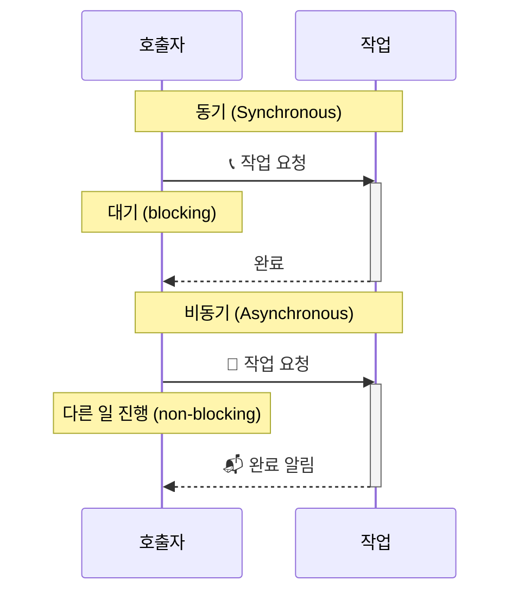
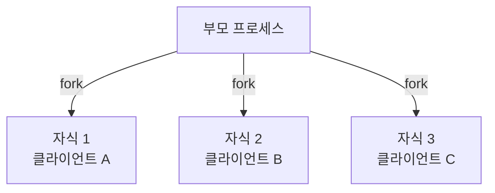

## 2.6 동기와 비동기를 철저하게 이해한다.

**동기(Synchronous)는 호출한 함수가 작업을 완료할 때까지 호출자가 대기하는 실행 방식이다.**

**비동기(Asynchronous)는 호출한 함수가 즉시 반환되어 호출자가 대기하지 않고 다른 작업을 계속 실행할 수 있는 방식이다.**

**비동기 결과 처리 2가지:**

1. **Fire-and-Forget**: 결과 신경 안 씀 (예: 로그 전송)
2. **Notification**: 완료되면 알려줌 (콜백/이벤트/폴링)

## 2.7 블로킹과 논블로킹

**블로킹(Blocking)은 함수 호출 시 제어권이 반환되지 않아 호출자가 대기하는 방식이다.**

**논블로킹(Non-blocking)은 함수 호출 시 제어권이 즉시 반환되어 호출자가 다른 작업을 할 수 있는 방식이다.**

|             | 블로킹         | 논블로킹       |
| ----------- | -------------- | -------------- |
| 제어권      | 반환 안 됨 🛑  | 즉시 반환 ✅   |
| 다른 작업   | 불가능         | 가능           |
| 스레드 상태 | 대기 (blocked) | 실행 (running) |
| 비유        | 창구 대기      | 진동벨 시스템  |

## 2.7.1~6 동기/비동기 vs 블로킹/논블로킹

> [!NOTE]
> 다른 관점에서 바라보는 독립적인 개념이다.  
> **논블로킹이 반드시 비동기를 의미하지 않는다!**

**동기/비동기 = 결과 처리 방식**

- 동기: 호출자가 직접 결과 받음
- 비동기: 완료 시 알림 받음

**블로킹/논블로킹 = 제어권 반환 여부**

- 블로킹: 제어권 안 돌려줌 (대기)
- 논블로킹: 제어권 즉시 반환

### 조합 예시

**동기 + 블로킹** (가장 일반적)

- 카운터 대기: 주문 → 서서 대기 → 직접 받음
- 코드: `readFileSync()` - 일반 함수

**비동기 + 논블로킹** (가장 효율적)

- 진동벨: 주문 → 자리 이동 → 벨 울리면 받으러 감
- 코드: `readFile(callback)` - 콜백/Promise/async-await

**동기 + 논블로킹** (폴링)

- 계속 확인: 주문 → "다 됐나요?" 반복 → 직접 받음
- 코드: 상태 반복 확인

|                      | 블로킹        | 논블로킹                 |
| -------------------- | ------------- | ------------------------ |
| **동기 (직접 받음)** | 일반 함수     | 폴링                     |
| **비동기 (알림)**    | ❌ 거의 안 씀 | 콜백/Promise/async-await |

👉🏻 **독립적인 개념이라 조합 가능!**

### 정리

(Process, Thread, Coroutine) + (동기, 비동기, 블로킹, 논블로킹) = 고성능 서버

실행 단위(Process/Thread/Coroutine)와 통신 방식(동기/비동기/블로킹/논블로킹)을 조합하면 다양한 서버 아키텍처를 설계할 수 있다.  
예: Node.js는 싱글 스레드 + 비동기 논블로킹, Apache는 멀티 프로세스 + 동기 블로킹

## 2.8 높은 동시성과 고성능을 갖춘 서버 구현

> [!NOTE]
> 모바일 인터넷의 출현으로 스마트폰으로 음식주문, 택시 타기 등 많은 일을 할 수 있게 되었다.
> 이런 편의를 누릴 수 있도록 수천 개부터 수만 개까지 사용자 요청을 동시에 처리해주는 서버 비밀에 대해 생각해보자

### 2.8.1 다중 프로세스

가장 먼저 출현한 기술은 간단한 형태의 병행 처리 방식의 일종인 다중 프로세스를 사용하는 것이었다.

요청 올 때마다 `fork()`로 자식 프로세스 생성 → 각 자식이 독립적으로 클라이언트 처리

**이 방식의 장점 ✨**

1. 프로그래밍이 간단하여 이해하기 쉽다
2. 개별 프로세스의 주소 공간은 격리되어 있기 때문에 하나의 프로세스에 문제가 발생하여 강제 종료되더라도 다른 프로세스에는 영향을 미치지 않음
3. 다중 코어 리소스를 최대한 활용할 수 있음

**이 방식의 단점 🤮**

1. 프로세스의 주소 공간이 격리되어있어서 프로세스간 통신이 필요할 때 난이도가 올라감.
2. 프로세스 생성할 때 부담이 크고, 프로세스의 빈번한 생성과 종료는 시스템 부담을 증가시킨다.

다행히도 프로세스 대신 스레드도 사용할 수 있다

> [!NOTE] > **fork의 의미 = 분기**  
> 원본을 유지하면서 독립적인 복사본/흐름을 만드는 것!
>
> - **OS fork()**: 프로세스 복제 → 부모/자식 둘 다 실행
> - **Git fork**: 저장소 복제 → 원본/포크 둘 다 독립 개발
> - **Redux-saga fork()**: 태스크 생성 → 메인/포크 둘 다 실행
>
> 👉🏻 모두 "원본은 계속, 복사본도 독립적으로"라는 개념!

### 2.8.2 다중 스레드
