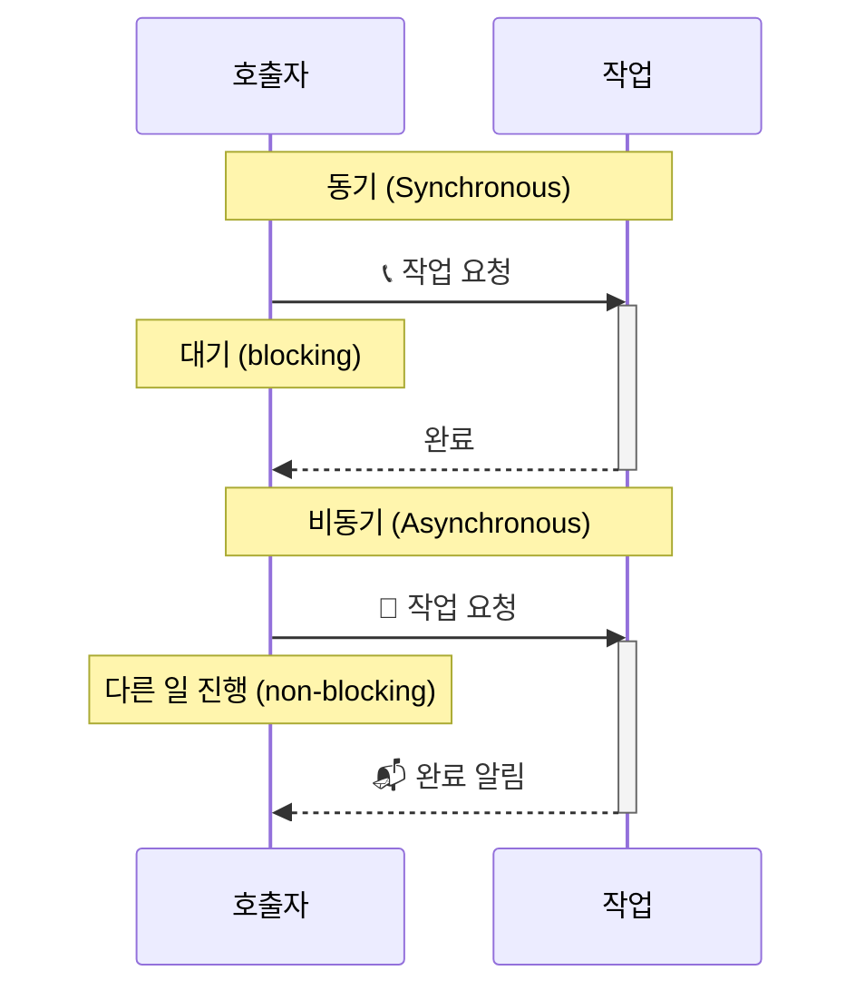
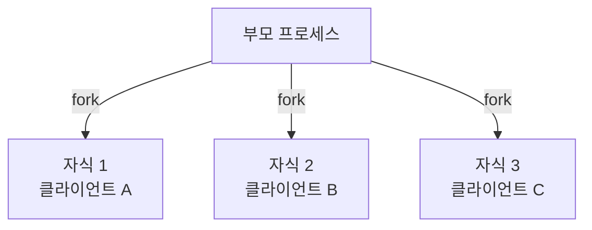
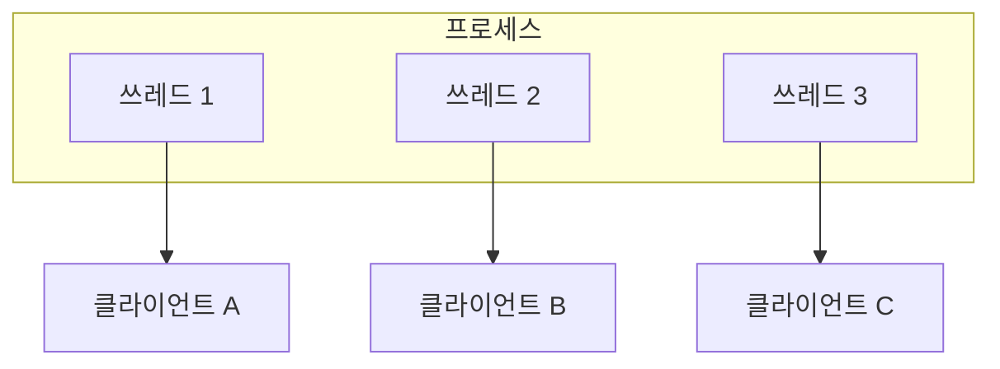

## 2.6 동기와 비동기를 철저하게 이해한다.

**동기(Synchronous)는 호출한 함수가 작업을 완료할 때까지 호출자가 대기하는 실행 방식이다.**

**비동기(Asynchronous)는 호출한 함수가 즉시 반환되어 호출자가 대기하지 않고 다른 작업을 계속 실행할 수 있는 방식이다.**



**비동기 결과 처리 2가지:**

1. **Fire-and-Forget**: 결과 신경 안 씀 (예: 로그 전송)
2. **Notification**: 완료되면 알려줌 (콜백/이벤트/폴링)

## 2.7 블로킹과 논블로킹

**블로킹(Blocking)은 함수 호출 시 제어권이 반환되지 않아 호출자가 대기하는 방식이다.**

**논블로킹(Non-blocking)은 함수 호출 시 제어권이 즉시 반환되어 호출자가 다른 작업을 할 수 있는 방식이다.**

|             | 블로킹         | 논블로킹       |
| ----------- | -------------- | -------------- |
| 제어권      | 반환 안 됨 🛑  | 즉시 반환 ✅   |
| 다른 작업   | 불가능         | 가능           |
| 스레드 상태 | 대기 (blocked) | 실행 (running) |
| 비유        | 창구 대기      | 진동벨 시스템  |

## 2.7.1~6 동기/비동기 vs 블로킹/논블로킹

> [!NOTE]
> 다른 관점에서 바라보는 독립적인 개념이다.  
> **논블로킹이 반드시 비동기를 의미하지 않는다!**

**동기/비동기 = 결과 처리 방식**

- 동기: 호출자가 직접 결과 받음
- 비동기: 완료 시 알림 받음

**블로킹/논블로킹 = 제어권 반환 여부**

- 블로킹: 제어권 안 돌려줌 (대기)
- 논블로킹: 제어권 즉시 반환

### 조합 예시

**동기 + 블로킹** (가장 일반적)

- 카운터 대기: 주문 → 서서 대기 → 직접 받음
- 코드: `readFileSync()` - 일반 함수

**비동기 + 논블로킹** (가장 효율적)

- 진동벨: 주문 → 자리 이동 → 벨 울리면 받으러 감
- 코드: `readFile(callback)` - 콜백/Promise/async-await

**동기 + 논블로킹** (폴링)

- 계속 확인: 주문 → "다 됐나요?" 반복 → 직접 받음
- 코드: 상태 반복 확인

|                      | 블로킹        | 논블로킹                 |
| -------------------- | ------------- | ------------------------ |
| **동기 (직접 받음)** | 일반 함수     | 폴링                     |
| **비동기 (알림)**    | ❌ 거의 안 씀 | 콜백/Promise/async-await |

👉🏻 **독립적인 개념이라 조합 가능!**

### 정리

(Process, Thread, Coroutine) + (동기, 비동기, 블로킹, 논블로킹) = 고성능 서버

실행 단위(Process/Thread/Coroutine)와 통신 방식(동기/비동기/블로킹/논블로킹)을 조합하면 다양한 서버 아키텍처를 설계할 수 있다.  
예: Node.js는 싱글 스레드 + 비동기 논블로킹, Apache는 멀티 프로세스 + 동기 블로킹

## 2.8 높은 동시성과 고성능을 갖춘 서버 구현

> [!NOTE]
> 모바일 인터넷의 출현으로 스마트폰으로 음식주문, 택시 타기 등 많은 일을 할 수 있게 되었다.
> 이런 편의를 누릴 수 있도록 수천 개부터 수만 개까지 사용자 요청을 동시에 처리해주는 서버 비밀에 대해 생각해보자

### 2.8.1 다중 프로세스

가장 먼저 출현한 기술은 간단한 형태의 병행 처리 방식의 일종인 다중 프로세스를 사용하는 것이었다.



요청 올 때마다 `fork()`로 자식 프로세스 생성 → 각 자식이 독립적으로 클라이언트 처리

**이 방식의 장점 ✨**

1. 프로그래밍이 간단하여 이해하기 쉽다
2. 개별 프로세스의 주소 공간은 격리되어 있기 때문에 하나의 프로세스에 문제가 발생하여 강제 종료되더라도 다른 프로세스에는 영향을 미치지 않음
3. 다중 코어 리소스를 최대한 활용할 수 있음

**이 방식의 단점 🤮**

1. 프로세스의 주소 공간이 격리되어있어서 프로세스간 통신이 필요할 때 난이도가 올라감.
2. 프로세스 생성할 때 부담이 크고, 프로세스의 빈번한 생성과 종료는 시스템 부담을 증가시킨다.

다행히도 프로세스 대신 스레드도 사용할 수 있다

> [!NOTE] > **fork의 의미 = 분기**  
> 원본을 유지하면서 독립적인 복사본/흐름을 만드는 것!
>
> - **OS fork()**: 프로세스 복제 → 부모/자식 둘 다 실행
> - **Git fork**: 저장소 복제 → 원본/포크 둘 다 독립 개발
> - **Redux-saga fork()**: 태스크 생성 → 메인/포크 둘 다 실행
>
> 👉🏻 모두 "원본은 계속, 복사본도 독립적으로"라는 개념!

### 2.8.2 다중 스레드

> [!NOTE] > **프로세스간 통신이 힘들다 = 스레드**
>
> - 스레드는 스레드간 통신을 위해 별도의 통신 작동 방식을 사용할 필요가 없다.
> - 스레드는 메모리를 직접 읽어서 데이터를 얻을 수 있다.



- 근데 스레드가 과연 완벽할까?
  - No. 스레드간 통신에 있어는 편리를 주지만
  - 스레드는 같은 주소 공간을 공유하기 때문에
    - 하나의 스레드에 문제가 발생하여 강제종료되면 같은 프로세스를 공유하는 스레드와 프로세스까지 강제 종료된다.
    - 공유 데이터의 주소를 동시에 쓰려고 하면 동기화 시 상호 배제와 같은 작동방식을 사용할 수 있다.
    - 교착 상태와 같은 문제를 일으킬 수 있다.
  - 단점은 있지만 다중 프로세스와 비교할 때 스레드가 훨씬 유리
    - 사용자 규모가 크지 않은 경우 다중 스레드로 충분히 처리 가능하다.

### 2.8.3 이벤트 순환과 이벤트 구동

- 이벤트: 입출력에 관계된 것. 예를들어 네트워크 데이터의 수신 여부, 파일의 읽기 및 쓰기 가능 여부 등이 관심 대상인 이벤트에 해당
- 이벤트를 처리하는 함수: event handler

#### epoll이란?

**epoll은 여러 파일 디스크립터의 I/O 이벤트를 효율적으로 감시하고 처리하는 Linux 커널의 이벤트 알림 메커니즘이다.**

**동작 방식:**

1. 관심 있는 파일 디스크립터들을 epoll에 등록
2. 이벤트 발생 시 커널이 알려줌 (읽기 가능, 쓰기 가능 등)
3. 해당 이벤트만 처리 (event handler 호출)

**왜 필요한가?**

|              | select/poll (전통 방식) | epoll (개선 방식)     |
| ------------ | ----------------------- | --------------------- |
| 확인 방식    | 모든 소켓 일일이 확인   | 이벤트 발생한 것만    |
| 성능         | O(n) - 느림             | O(1) - 빠름           |
| 동시 연결 수 | 수백~수천 개            | 수만~수십만 개        |
| 비유         | 창문 1000개 일일이 확인 | 창문 열리면 알림 받음 |

👉🏻 **Node.js, Nginx 같은 고성능 서버가 epoll을 사용해서 수만 개 동시 연결을 처리한다!**

## 2.9 지금까지 배운 걸로 이해하는 컨테이너 vs 가상머신

> [!NOTE]
> 프로세스, 스레드, 격리, 리소스 관리...  
> 지금까지 배운 모든 개념이 컨테이너와 가상머신으로 연결된다!

### 정의

**가상머신(VM)은 하드웨어를 가상화하여 완전한 운영체제를 포함한 독립적인 컴퓨팅 환경을 제공하는 기술이다.**

**컨테이너(Container)는 OS 수준에서 프로세스를 격리하여 독립적인 실행 환경을 제공하는 경량 가상화 기술이다.**

### 지금까지 배운 개념으로 이해하기

**가상머신 = 완전히 독립된 컴퓨터**

```
물리 서버
├── 하이퍼바이저 (VMware, VirtualBox)
├── VM 1 (Linux OS 전체)
│   ├── 커널
│   ├── 프로세스들
│   └── 메모리 (2GB 할당)
├── VM 2 (Windows OS 전체)
│   ├── 커널
│   ├── 프로세스들
│   └── 메모리 (4GB 할당)
└── VM 3 (Linux OS 전체)
    ├── 커널
    ├── 프로세스들
    └── 메모리 (2GB 할당)
```

- **프로세스 관점**: 각 VM은 완전히 독립된 OS = 완전히 독립된 프로세스 관리 시스템
- **격리 수준**: 하드웨어 수준 격리 (강력)
- **무게**: 무거움 (OS 전체를 복제하니까)
- **시작 시간**: 느림 (부팅 필요)

**컨테이너 = 격리된 프로세스**

```
물리 서버
├── 호스트 OS (Linux)
│   └── 커널 (공유!)
├── Container 1 (Nginx)
│   ├── 격리된 프로세스 공간
│   └── 필요한 라이브러리만
├── Container 2 (Node.js)
│   ├── 격리된 프로세스 공간
│   └── 필요한 라이브러리만
└── Container 3 (MySQL)
    ├── 격리된 프로세스 공간
    └── 필요한 라이브러리만
```

- **프로세스 관점**: 컨테이너 = 네임스페이스로 격리된 프로세스 (2.1절의 프로세스 개념!)
- **격리 수준**: OS 수준 격리 (네임스페이스, cgroup)
- **무게**: 가벼움 (커널 공유, 앱만 포함)
- **시작 시간**: 빠름 (프로세스 시작이니까)

### 비교

|                 | 가상머신 (VM)                    | 컨테이너 (Container)      |
| --------------- | -------------------------------- | ------------------------- |
| **가상화 수준** | 하드웨어 가상화                  | OS 수준 가상화            |
| **OS**          | 각 VM마다 전체 OS                | 호스트 OS 커널 공유       |
| **프로세스**    | 완전 독립 (다중 프로세스의 극단) | 격리된 프로세스           |
| **격리**        | 강력 (하드웨어 수준)             | 중간 (네임스페이스)       |
| **크기**        | GB 단위 (OS 포함)                | MB 단위 (앱만)            |
| **시작 시간**   | 분 단위 (부팅)                   | 초 단위 (프로세스 시작)   |
| **오버헤드**    | 높음                             | 낮음                      |
| **사용 사례**   | 완전한 격리 필요 시              | 빠른 배포, 마이크로서비스 |
| **대표 기술**   | VMware, VirtualBox, KVM          | Docker, Kubernetes        |

### 우리가 배운 개념과의 연결

**1. 프로세스 격리 (2.1절)**

- VM: 각 VM은 독립된 프로세스 관리 시스템
- 컨테이너: Linux 네임스페이스로 프로세스 격리

**2. 리소스 공유 vs 독립 (2.1.4절 - 스레드)**

- VM: 프로세스처럼 독립 (메모리 독립)
- 컨테이너: 스레드처럼 공유 (커널 공유)

**3. 오버헤드**

- VM: 다중 프로세스의 무게 (각 프로세스가 OS 전체)
- 컨테이너: 스레드의 가벼움 (공유 + 격리)

**4. 실제 서버 아키텍처**

```
클라우드 서버 (물리 머신)
├── VM 1: 프론트엔드 서버
│   ├── Container: Nginx
│   └── Container: React App
├── VM 2: 백엔드 서버
│   ├── Container: Node.js API (비동기+논블로킹+epoll!)
│   ├── Container: Redis
│   └── Container: PostgreSQL
└── VM 3: 데이터 처리
    └── Container: Kafka
```

👉🏻 **VM으로 강력한 격리, 컨테이너로 유연한 배포!**

### 왜 컨테이너가 뜨는가?

1. **마이크로서비스**: 작은 서비스 여러 개 = 컨테이너 여러 개
2. **빠른 배포**: 초 단위 시작 (프로세스니까!)
3. **리소스 효율**: 커널 공유로 메모리 절약
4. **이식성**: "내 컴퓨터에선 되는데?" 문제 해결

하지만 VM도 여전히 중요:

- 보안이 중요한 경우 (강력한 격리)
- 다른 OS 필요할 때 (Windows on Linux)
- 레거시 시스템

👉🏻 **결국 프로세스, 스레드, 격리, 가상화는 모두 "리소스를 효율적으로 쓰면서 안전하게 격리하자"는 같은 목표!**
